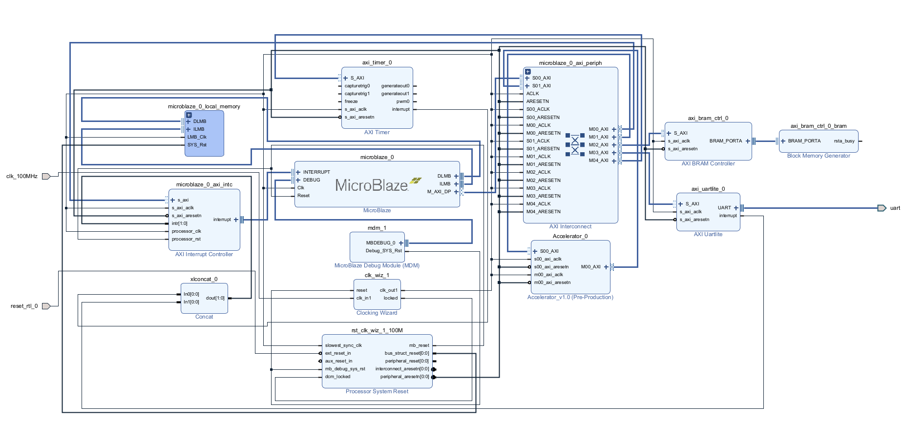

# Urbana FPGA MNIST Accelerator Demo

This project demonstrates a full end-to-end **MNIST inference system on the Urbana FPGA board**, combining a custom RTL accelerator, MicroBlaze firmware, and a browser-based front end. A user can draw a digit in the web UI, send it to the FPGA over UART, and receive a real-time prediction along with detailed performance benchmarks.

Beyond the demo itself, this project was designed as a learning-focused hardware/software co-design exercise. Instead of treating deep learning inference as a black box, the CNN pipeline was implemented and verified step by step—from training and quantization to RTL execution and cycle-accurate benchmarking.

---

## Project Motivation

In many commercial systems, GPUs are not always the best solution for inference. While GPUs excel at training and high-throughput batch inference, they can be inefficient or impractical for:

- Low-latency, real-time inference
- Power- or resource-constrained environments
- Deterministic execution requirements
- Tight coupling with custom I/O and memory systems

FPGAs offer a compelling alternative for inference in these cases. They allow designers to build **deterministic, deeply pipelined datapaths**, carefully control memory movement, and optimize for performance per watt.

This project explores those ideas on a **resource-limited FPGA platform (Urbana board)**. The goal was to achieve accurate and fast inference while staying within realistic hardware constraints, and to gain a deep understanding of how modern CNN inference maps onto hardware.

---

## Model Architecture

The neural network used in this project is a compact CNN designed to be hardware-friendly:

- **Input:** 1 × 28 × 28 (MNIST grayscale image)
- **Conv1:** 1 → 8 channels, 3×3 kernel, stride 1, padding 1  
  → ReLU → MaxPool (2×2)
- **Conv2:** 8 → 16 channels, 3×3 kernel, stride 1, padding 1  
  → ReLU → MaxPool (2×2)
- **Fully Connected:** 16 × 7 × 7 → 10 classes

After the second pooling layer, the feature map size is **16 × 7 × 7**, which is flattened and fed into the fully connected layer.

Training is implemented in PyTorch (`model/mnist_train.py`), and the trained parameters are exported for hardware use via a custom script (`model/export_weight.py`).

---

## Weight Quantization and Data Format

All weights used by the accelerator are **quantized to signed 8-bit integers**, which is a key design decision for hardware efficiency.

### Quantization details

- **Weights:** signed int8 (range −127 to +127)
- **Biases:** int32
- **Scale factor:** 256 (2⁸)

During export:
- Convolution weights are scaled by 256 and clipped to the int8 range
- Biases are scaled by **scale² (256 × 256)** to match accumulation precision
- Conv1 and Conv2 parameters are stored as interleaved sequences:

                [weights..., bias] per output channel

- Fully connected weights are:
- Reshaped from (10, 16, 7, 7)
- Reordered to (Out, Row, Col, Channel)
- Packed so that **four int8 weights form one 32-bit word (little-endian)**

This layout exactly matches the RTL consumption order, eliminating any runtime reformatting overhead.

---

## Accelerator Design Overview

The accelerator is implemented as a custom RTL IP and controlled by a MicroBlaze processor via AXI4-Lite.

### High-level operation

1. MicroBlaze writes weights and biases into BRAM
2. The accelerator runs a **one-time Weight Load Mode**, caching weights internally
3. For each inference:
 - Input image is written to BRAM
 - Accelerator is triggered
 - CNN computation runs fully in hardware
 - Logits, predicted label, and cycle count are produced

### Compute pipeline

- **Conv1 → ReLU → Shift → Clip → MaxPool**
- **Conv2 → ReLU → MaxPool**
- **Fully Connected → Argmax**

### Numeric behavior

- All weights are signed 8-bit
- **Conv1 output includes a right shift** after ReLU to control dynamic range
- **Conv2 has no shift**; accumulation is kept at higher precision
- Clipping is applied only where necessary
- Accumulators are wider than weights to preserve correctness

---

## Cycle Counting and Benchmarking

The accelerator includes an internal cycle counter (`reg_cycles`) that increments **only during compute states**:

- `RUN_CONV1`
- `RUN_CONV2`
- `RUN_FC`
- `FC_CHECK_MAX`

This means the reported hardware cycles represent **compute-only performance**, excluding:
- UART transfer time
- Weight loading
- Cache flush/invalidate
- Control and software overhead

The accelerator runs at a **confirmed 100 MHz clock**.

For comparison, a software reference implementation runs on the same MicroBlaze processor, and its execution time is measured using an **AXI timer**. This provides a clean apples-to-apples comparison: same algorithm, same data, same platform—hardware datapath versus software execution.

---

## Example Benchmark Result

From a representative demo run:

- **HW cycles:** 13,578  
- **SW cycles:** 45,342,408  
- **Speedup:** ~3339×  
- **HW time @100 MHz:** ~0.136 ms  
- **Prediction confidence:** 100%

This clearly demonstrates the benefit of a dedicated hardware datapath for CNN inference compared to a general-purpose embedded CPU.

---

## End-to-End Demo Pipeline

1. **Front-end (Browser)**
 - User draws a digit on a web canvas
 - Presses “Inference”

2. **Host Application (Python)**
 - Image is converted to a 784-byte array
 - Sent to FPGA over UART
 - Receives prediction, logits, and timing information

3. **Firmware (MicroBlaze)**
 - Writes input image to BRAM
 - Triggers the accelerator
 - Reads results and sends them back over UART

4. **Hardware Accelerator**
 - Executes CNN inference
 - Outputs label, logits, and compute cycle count

Results are displayed live in the web interface.

---

## Hardware Block Diagram

At a high level, the system consists of:
- A MicroBlaze processor for control and communication
- BRAM for images and parameters
- A custom CNN accelerator IP
- UART interface for host communication

---

## Repository Structure
.
├── mnist_demo.gif
├── docs/
│ ├── block_diagram.png
│ └── demo_screenshot.png
├── firmware/
│ └── src/
│ ├── host.c
│ ├── mnist_sw_infer.c
│ ├── mnist_sw_infer.h
│ └── weights.h
├── host_app/
│ ├── app.py
│ └── templates/
│ └── index.html
├── hw/
│ └── src/
│ └── ip_repo/
│ └── Accelerator_1_0/
│ └── src/
│ ├── Accelerator_v1_0.sv
│ ├── bramReader.sv
│ ├── ComputeEngine.sv
│ └── LineBuffer.sv
└── model/
├── mnist_train.py
├── export_weight.py
└── mnist_smallcnn_state_dict.pt

---

## Debug and Verification Support

The repository also includes debug utilities used during development:
- Integer-accurate Python simulation of the hardware pipeline
- Full 7×7×16 feature map comparisons between FPGA and software
- Coordinate-level mismatch reporting

These tools are not part of the final demo flow, but they were essential for validating correctness and are retained for future debugging.

---

## Key Takeaways

- Designed and implemented a complete **HW/SW co-designed CNN inference system**
- Built a custom RTL accelerator with quantized arithmetic and explicit data layout
- Achieved large compute-only speedups on a constrained FPGA platform
- Gained hands-on experience with:
  - Quantization and fixed-point design
  - FSM-level performance instrumentation
  - AXI-based system integration
  - End-to-end deployment and live demo engineering

